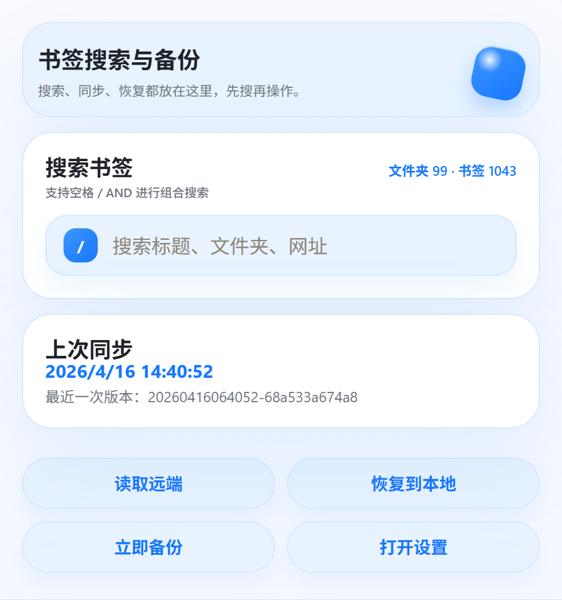
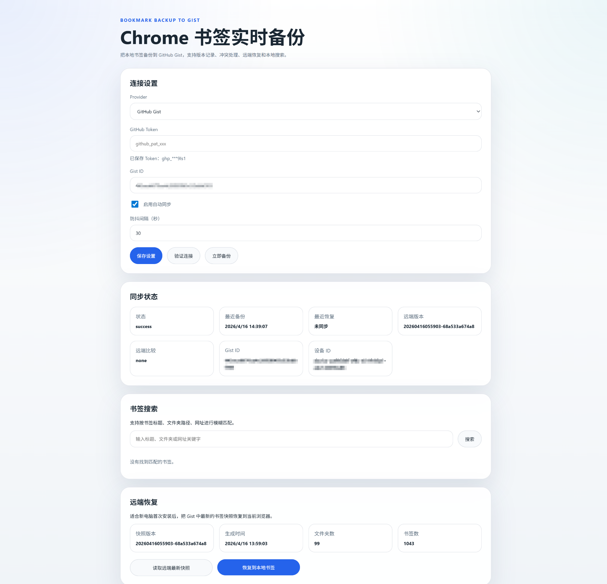
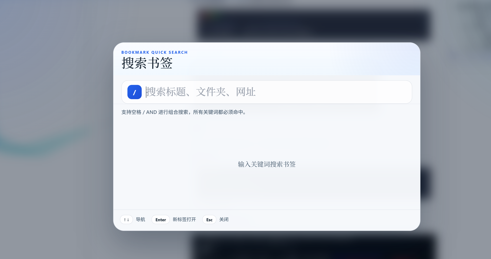

# Bookmark Backup to Gist

一个基于 Chrome Manifest V3 的书签备份扩展，用来实时监听浏览器书签变化，并把标准化后的书签快照备份到 GitHub Gist。

当前版本重点解决 4 件事：

- 可靠备份：监听书签变化并自动触发备份
- 可恢复：支持从 Gist 最新快照恢复到当前浏览器
- 可判断新旧：保存版本元数据，识别谁新谁旧
- 可检测冲突：本地和远端同时变化时不直接覆盖





## 当前进度

目前已经完成的能力：

- 已完成 Chrome MV3 扩展基础结构
- 已完成 GitHub Gist 作为首个备份后端
- 已完成手动填写 GitHub Token 的配置方式
- 已完成首次全量备份
- 已完成书签新增、删除、移动、重命名后的实时监听
- 已完成短延迟防抖聚合同步，避免频繁写入 Gist
- 已完成标准化书签树快照和内容哈希计算
- 已完成版本元数据保存与最近历史记录保存
- 已完成远端较新、本地较新、内容一致、发生分叉等状态识别
- 已完成冲突保留策略，不会在检测到分叉时直接覆盖远端
- 已完成“以本地覆盖远端”和“接受远端为最新”两种冲突处理方式
- 已完成从 Gist 最新快照恢复到当前 Chrome 书签
- 已完成插件弹窗中的本地书签搜索
- 已完成设置页中的本地书签搜索
- 已完成按标题、文件夹路径、网址的模糊搜索
- 已完成 AND 条件搜索，支持多关键词同时匹配
- 已完成网页内快捷搜索浮层
- 已完成快捷键入口
  - Windows: `Ctrl+Shift+F`
  - macOS: `Command+Shift+F`
- 已完成点击搜索结果后新开标签页打开书签
- 已完成更现代化的弹窗 UI 和新的插件图标

当前已预留但还没有实现：

- WebDAV 备份后端
- 本地文件夹备份后端
- 自动三方合并冲突
- GitHub OAuth 登录

## 项目结构

```text
.
├─ background.js          # Service Worker，负责监听、同步、恢复、消息分发
├─ popup.html
├─ popup.css
├─ popup.js               # 插件弹窗，展示状态、搜索、手动备份入口
├─ options.html
├─ options.css
├─ options.js             # 设置页，配置 Gist、查看状态、恢复、搜索
├─ content-search.js      # 页面内快捷搜索浮层
├─ content-search.css
├─ manifest.json
├─ icons/
├─ lib/
│  ├─ bookmarks.js        # 书签标准化、搜索索引、查询逻辑
│  ├─ storage.js          # 本地配置与同步状态存储
│  ├─ sync-engine.js      # 同步核心、冲突判断、版本推进
│  ├─ utils.js
│  └─ providers/
│     └─ gist.js          # Gist Provider 实现
└─ tests/                 # 核心逻辑测试
```

## 当前数据设计

远端使用一个 Gist 保存多份文件：

- `bookmark-backup.manifest.json`
  - 当前最新版本指针
  - 最新版本摘要
  - schema 版本
- `bookmark-backup.tree.json`
  - 当前最新的标准化书签树快照
- `bookmark-backup.history.json`
  - 最近若干次版本摘要
- `bookmark-backup.conflicts.json`
  - 最近冲突记录
- `bookmark-backup.conflict.latest.json`
  - 最新一次冲突的详细信息

每次备份的核心元数据包含：

- `versionId`
- `deviceId`
- `createdAt`
- `sourceRevision`
- `treeHash`
- `schemaVersion`

## 搜索能力

当前搜索基于本地书签缓存，不依赖远端请求，适合高频使用。

支持的搜索范围：

- 书签标题
- 文件夹路径
- 书签网址

支持的查询方式：

- 模糊匹配
- 多关键词 AND 匹配
- 会忽略连接词，例如 `and`、`&&`、`且`

示例：

- `openai docs`
- `ai github`
- `frontend and design`
- `google drive`

以上查询都会要求多个关键词同时命中同一条书签记录的索引内容。

## 安装方式

### 1. 本地加载扩展

1. 打开 `chrome://extensions`
2. 开启“开发者模式”
3. 点击“加载已解压的扩展程序”
4. 选择当前目录：`e:\ai-projects\bookmark-backup`

### 2. 配置 GitHub Gist

1. 打开扩展的设置页
2. 选择 `GitHub Gist`
3. 填写 GitHub Personal Access Token
4. 可选填写已有 `gistId`
5. 点击“保存设置”
6. 点击“验证连接”
7. 点击“立即备份”进行首次同步

说明：

- 如果没有填写 `gistId`，首次备份时会自动创建一个私有 Gist
- Token 需要具备访问 Gist 的权限
- Token 只保存在本地 `chrome.storage.local`

## 使用说明

### 自动备份

- 扩展启动后会做一次远端对账
- 书签发生变化后会进入防抖窗口
- 防抖窗口结束后生成新的标准化快照
- 如果内容没有变化，不会重复创建新版本

### 手动备份

- 点击弹窗或设置页里的“立即备份”
- 扩展会先读取远端最新版本，再决定是否可以提交

### 恢复远端最新快照

适合新电脑首次安装扩展后，把同一个 Gist 中的最新书签恢复到当前浏览器。

操作步骤：

1. 安装扩展
2. 填写和原设备相同的 Token 与 `gistId`
3. 点击“读取远端最新快照”
4. 确认远端版本信息
5. 点击“恢复到本地书签”

注意：

- 当前恢复逻辑会按远端快照重建浏览器书签结构
- 这不是三方合并，而是基于快照的恢复操作

### 快捷搜索

可以通过两种方式使用搜索：

- 点击插件图标，在弹窗中搜索
- 使用快捷键呼出网页内快捷搜索框

快捷键：

- Windows: `Ctrl+Shift+F`
- macOS: `Command+Shift+F`

搜索结果点击后会新开一个标签页打开对应书签。

## 冲突策略

当前版本采用“保留双版本，不自动覆盖”的安全策略。

在每次写入前，扩展会先读取远端 `manifest`：

- 如果远端版本和本地已知基线一致，允许提交新版本
- 如果远端已变化，但本地没有未同步改动，标记为远端较新
- 如果远端已变化，且本地也有新改动，判定为冲突

发生冲突后：

- 不直接覆盖远端
- 保留本地候选版本
- 保留远端最新引用
- 在 UI 中提示用户手动处理

当前支持两种处理方式：

- 以本地覆盖远端
- 接受远端为最新

## 已知边界

- GitHub Gist API 没有真正的原子 compare-and-swap
- 当前实现是“先读最新 manifest，再尝试写入”的最佳努力方案
- 当前恢复不是双向同步，不会自动把远端和本地做细粒度合并
- “接受远端为最新”主要更新扩展内部同步基线，不会自动修改本地书签内容
- WebDAV 和本地文件夹后端目前只有接口预留，还没有真正实现

## 权限说明

当前扩展只申请了和功能直接相关的最小权限：

- `bookmarks`
  - 读取、监听、恢复 Chrome 书签
- `storage`
  - 保存 Token、Gist ID、同步状态、设备 ID
- `tabs`
  - 点击搜索结果后新开标签页

当前网络权限：

- `https://api.github.com/*`
- `https://gist.githubusercontent.com/*`

## 本地开发

安装依赖后可直接运行测试：

```powershell
npm test
```

当前 `package.json` 中已提供：

- `npm test`：运行 Node 内置测试

## 测试关注点

当前应重点验证这些场景：

- 无 `gistId` 时首次自动创建私有 Gist
- 有 `gistId` 时继续基于已有远端版本追加
- 书签新增、删除、移动、重命名后只触发一次聚合备份
- 内容未变化时不重复创建远端新版本
- 多设备写入同一个 Gist 时能识别 revision 分叉
- 冲突时进入可见状态而不是直接覆盖
- 新电脑可以从远端最新快照恢复书签
- 搜索支持标题、文件夹、网址的模糊匹配
- 搜索支持多关键词 AND 匹配
- 点击搜索结果后能新开标签页
- 快捷键能呼出页面内搜索浮层

## 下一步建议

后续比较适合继续推进的方向：

1. 实现 WebDAV Provider
2. 实现本地文件夹 Provider
3. 增加版本浏览与指定版本恢复
4. 增加导出/导入扩展配置
5. 增加更细粒度的冲突对比视图
6. 评估 GitHub OAuth 替代手动 Token
